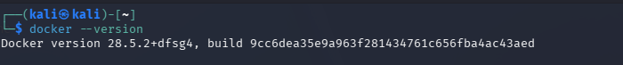
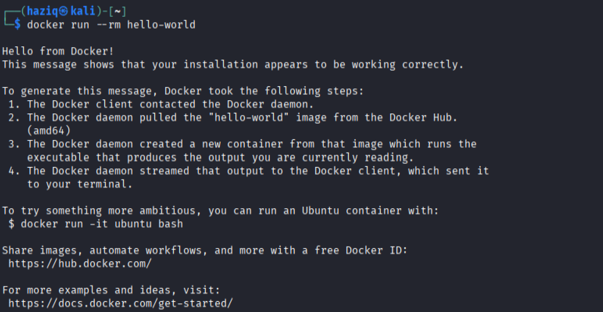
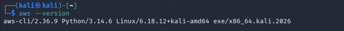
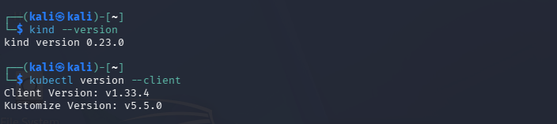
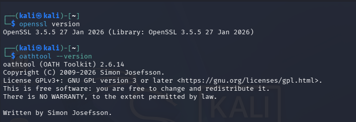
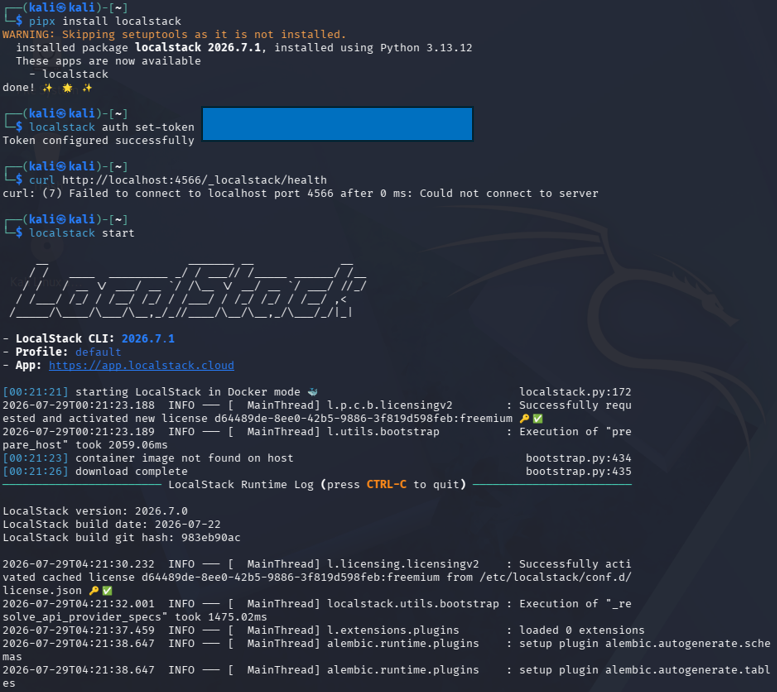
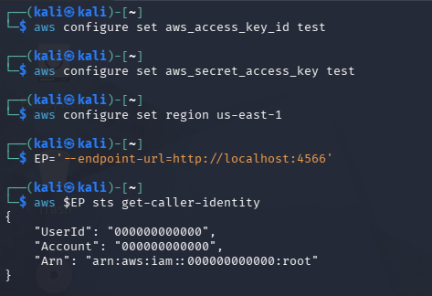
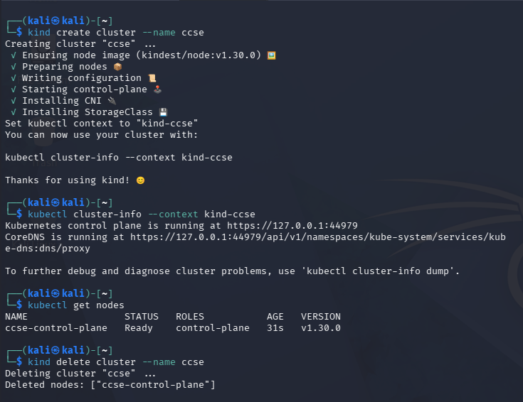

# IKB42603 Cloud Computing Security Essentials
## Lab 0 — Environment Setup

> **Local Cloud Security Laboratory Environment Verification**

---

## Student Information

| Item | Details |
|---|---|
| **Student Name** | Muhammad Abid Haziq Bin Muhammad Ali |
| **Student ID** | 52215124811 |
| **Module Code** | IKB42603 |
| **Module Name** | Cloud Computing Security Essentials |
| **Lab** | Lab 0 — Environment Setup |
| **Institution** | Universiti Kuala Lumpur Malaysian Institute of Information Technology (UniKL MIIT) |
| **Lecturer** | Nor Adani Kamal Mohamad Nasir |

---

## Table of Contents

1. [Introduction](#1-introduction)
2. [Environment Summary](#2-environment-summary)
3. [Docker Verification](#3-docker-verification)
4. [AWS CLI Verification](#4-aws-cli-verification)
5. [Kubernetes Tooling Verification](#5-kubernetes-tooling-verification)
6. [Cryptographic and MFA Tooling Verification](#6-cryptographic-and-mfa-tooling-verification)
7. [LocalStack Setup and Health Verification](#7-localstack-setup-and-health-verification)
8. [AWS CLI Connectivity to LocalStack](#8-aws-cli-connectivity-to-localstack)
9. [Local Kubernetes Cluster Verification](#9-local-kubernetes-cluster-verification)
10. [Verification Checklist](#10-verification-checklist)
11. [Observations and Security Relevance](#11-observations-and-security-relevance)
12. [Conclusion](#12-conclusion)
13. [Source Materials](#13-source-materials)
14. [Repository Structure](#14-repository-structure)

---

# 1. Introduction

This report documents the setup and verification of the local environment used for **IKB42603 Cloud Computing Security Essentials**.

The purpose of the setup was to confirm that the main command-line tools and local cloud technologies required for later laboratory activities were installed and functioning correctly. The supplied evidence demonstrates successful verification of **Docker**, **AWS CLI**, **kind**, **kubectl**, **Kustomize**, **OpenSSL**, **OATH Toolkit**, **LocalStack**, and a local **Kubernetes** cluster.

The environment was tested from Kali Linux using command-line verification commands and practical functional checks. These checks go beyond confirming that an executable exists: Docker was used to run a test container, LocalStack was started and queried through its health endpoint, AWS CLI successfully called LocalStack STS, and a Kubernetes cluster was created and verified in the `Ready` state.

---

# 2. Environment Summary

The final consolidated evidence records the following environment versions:

| Component | Verified Version / State |
|---|---|
| **Docker** | 28.5.2 |
| **AWS CLI** | 2.36.9 |
| **kind** | 0.23.0 |
| **kubectl** | v1.33.4 |
| **Kustomize** | v5.5.0 |
| **OpenSSL** | 3.5.5 |
| **OATH Toolkit / oathtool** | 2.6.14 |
| **LocalStack CLI** | 2026.7.1 |
| **LocalStack Runtime** | 2026.7.0 |
| **Kubernetes Node** | `ccse-control-plane` |
| **Kubernetes Node Status** | `Ready` |
| **Kubernetes Node Version** | v1.30.0 |

> **Evidence note:** A separate supporting screenshot document contains a few earlier captures with minor version differences. To keep this report internally consistent, the version values above follow the consolidated Lab 0 evidence document. The additional Docker `hello-world` screenshot is used as functional proof because it demonstrates successful container execution.

---

# 3. Docker Verification

## 3.1 Verify the Docker Version

Docker was first checked from the Kali Linux terminal using:

```bash
docker --version
```

The command returned:

```text
Docker version 28.5.2
```



*Figure 1: Docker version verification showing Docker 28.5.2 installed in the Kali Linux environment.*

This confirms that the Docker command-line client is installed and available from the terminal.

---

## 3.2 Functional Docker Test

A version check alone only proves that the Docker command exists. A practical test was therefore also performed by running Docker's `hello-world` container:

```bash
docker run --rm hello-world
```



*Figure 2: Successful execution of the Docker `hello-world` container, confirming communication between the Docker client and daemon and successful container execution.*

The output displays:

```text
Hello from Docker!
This message shows that your installation appears to be working correctly.
```

This functional test demonstrates that Docker can:

1. Contact the Docker daemon.
2. Obtain the required image.
3. Create a container.
4. Execute the container.
5. Return the output to the terminal.

Therefore, Docker was not only installed but operational.

---

# 4. AWS CLI Verification

The AWS Command Line Interface was checked using:

```bash
aws --version
```

The consolidated evidence records:

```text
aws-cli/2.36.9
```



*Figure 3: AWS CLI version verification showing AWS CLI 2.36.9 available in the Kali Linux environment.*

This confirms that AWS CLI is available for issuing AWS-compatible API commands. In this laboratory environment, the CLI is later pointed at **LocalStack** rather than a real AWS cloud account.

---

# 5. Kubernetes Tooling Verification

The local Kubernetes tooling was verified using the following commands:

```bash
kind --version
kubectl version --client
```

The evidence confirms:

```text
kind version 0.23.0
Client Version: v1.33.4
Kustomize Version: v5.5.0
```



*Figure 4: Verification of kind 0.23.0, kubectl client v1.33.4, and Kustomize v5.5.0.*

### Purpose of the Tools

- **kind (Kubernetes in Docker)** is used to create local Kubernetes clusters using Docker containers as cluster nodes.
- **kubectl** is the command-line interface used to communicate with and manage Kubernetes clusters.
- **Kustomize** provides Kubernetes configuration customization support and is integrated into kubectl.

The successful version checks confirm that the tools required for later Kubernetes exercises are accessible.

---

# 6. Cryptographic and MFA Tooling Verification

OpenSSL and the OATH Toolkit were verified using:

```bash
openssl version
oathtool --version
```

The consolidated evidence shows:

```text
OpenSSL 3.5.5
oathtool (OATH Toolkit) 2.6.14
```



*Figure 5: Verification of OpenSSL 3.5.5 and OATH Toolkit/oathtool 2.6.14.*

These tools provide useful security-related capabilities for later exercises:

- **OpenSSL** provides cryptographic functions and utilities for keys, certificates, hashing, and TLS-related operations.
- **oathtool** can generate one-time passwords based on OATH standards and is useful for exercises involving OTP or MFA concepts.

The screenshots confirm that both utilities are installed and callable from the Kali terminal.

---

# 7. LocalStack Setup and Health Verification

## 7.1 LocalStack Installation and Startup

The evidence shows LocalStack being installed using `pipx`:

```bash
pipx install localstack
```

An authentication token was configured for the LocalStack CLI. The actual token value is intentionally obscured in the screenshot.

The LocalStack health endpoint was initially queried before the service was running:

```bash
curl http://localhost:4566/_localstack/health
```

The initial request failed to connect because LocalStack had not yet been started. The service was then started with:

```bash
localstack start
```



*Figure 6: LocalStack installation and startup process. The first health request fails because the service is not yet running, after which `localstack start` launches the local AWS-compatible environment.*

The screenshot also records the LocalStack CLI version as:

```text
LocalStack CLI: 2026.7.1
```

The initial failed `curl` request is useful evidence because it demonstrates the difference between having the software installed and having the LocalStack service actively running.

---

## 7.2 LocalStack Health Check

After LocalStack was started, its health endpoint was queried again:

```bash
curl http://localhost:4566/_localstack/health
```

Docker container status was also checked:

```bash
docker ps
```


*Figure 7: Successful LocalStack health response together with `docker ps`, showing the LocalStack container running with a healthy status and exposing the local service on port 4566.*

The health response lists LocalStack services as available and reports the LocalStack runtime version as:

```text
2026.7.0
```

The `docker ps` output shows the LocalStack container as:

```text
Up ... (healthy)
```

and confirms that LocalStack is available through the expected local endpoint on **port 4566**.

This verifies that the local AWS-compatible service was operating correctly.

---

# 8. AWS CLI Connectivity to LocalStack

To use AWS CLI with LocalStack, dummy credentials were configured:

```bash
aws configure set aws_access_key_id test
aws configure set aws_secret_access_key test
aws configure set region us-east-1
```

A reusable endpoint variable was then configured:

```bash
EP='--endpoint-url=http://localhost:4566'
```

The following STS command was used to confirm AWS CLI connectivity:

```bash
aws $EP sts get-caller-identity
```



*Figure 8: Dummy AWS CLI credentials configured for LocalStack followed by a successful STS `get-caller-identity` response through the local endpoint.*

The response identifies the simulated account and root ARN:

```text
Account: 000000000000
Arn: arn:aws:iam::000000000000:root
```

The important result is that AWS CLI successfully communicated with the LocalStack STS-compatible API through:

```text
http://localhost:4566
```

> **Security note:** The credentials `test` / `test` are dummy values used by the local laboratory environment. They are not presented as real cloud credentials.

---

# 9. Local Kubernetes Cluster Verification

A local Kubernetes cluster named `ccse` was created using kind:

```bash
kind create cluster --name ccse
```

After creation, the cluster was checked using:

```bash
kubectl cluster-info --context kind-ccse
kubectl get nodes
```



*Figure 9: Creation and verification of the `ccse` kind cluster. `kubectl get nodes` confirms that `ccse-control-plane` is in the `Ready` state with Kubernetes version v1.30.0.*

The important node result was:

```text
NAME                 STATUS   ROLES           VERSION
ccse-control-plane   Ready    control-plane   v1.30.0
```

The `Ready` state confirms that the Kubernetes control-plane node was operational and available for use.

After the verification was completed, the temporary cluster was removed using:

```bash
kind delete cluster --name ccse
```

The output confirms that the cluster and its node were deleted successfully.

This demonstrates the complete local cluster lifecycle:

```text
Create → Verify → Use → Delete
```

---

# 10. Verification Checklist

| Requirement / Check | Status | Evidence |
|---|:---:|---|
| Docker installed | ✅ | Docker 28.5.2 version output |
| Docker functional | ✅ | `hello-world` executed successfully |
| AWS CLI installed | ✅ | AWS CLI 2.36.9 |
| kind installed | ✅ | kind 0.23.0 |
| kubectl installed | ✅ | kubectl v1.33.4 |
| Kustomize available | ✅ | Kustomize v5.5.0 |
| OpenSSL installed | ✅ | OpenSSL 3.5.5 |
| OATH Toolkit installed | ✅ | oathtool 2.6.14 |
| LocalStack installed | ✅ | LocalStack CLI started successfully |
| LocalStack health endpoint reachable | ✅ | Services returned as available |
| LocalStack container healthy | ✅ | `docker ps` shows healthy status |
| LocalStack available on port 4566 | ✅ | Docker port mapping and health request |
| Dummy AWS credentials configured | ✅ | AWS CLI configuration evidence |
| AWS CLI can communicate with LocalStack | ✅ | Successful STS caller identity |
| Kubernetes cluster created | ✅ | kind cluster creation |
| Kubernetes control plane accessible | ✅ | `kubectl cluster-info` |
| Kubernetes node is Ready | ✅ | `ccse-control-plane` Ready |
| Temporary Kubernetes cluster removed | ✅ | kind delete cluster output |

---

# 11. Observations and Security Relevance

## 11.1 Installation Is Different from Service Availability

The LocalStack evidence shows that an initial health request failed before the service was started. After running `localstack start`, the same local service became available.

This demonstrates an important troubleshooting principle: an installed tool is not automatically an active service. Both installation state and runtime state should be verified.

---

## 11.2 Functional Tests Provide Stronger Evidence Than Version Checks

Several checks in this lab demonstrate actual operation rather than only installation:

- Docker successfully executed `hello-world`.
- LocalStack returned a health response.
- Docker reported the LocalStack container as healthy.
- AWS CLI successfully called the LocalStack STS endpoint.
- kind successfully created a Kubernetes cluster.
- kubectl confirmed that the control-plane node was `Ready`.

These tests give stronger evidence that the environment is usable for later laboratory exercises.

---

## 11.3 LocalStack Separates Practice from a Real Cloud Account

AWS CLI was pointed at:

```text
http://localhost:4566
```

This indicates that the commands shown in this environment communicate with the local LocalStack service.

Using a local AWS-compatible environment is useful for learning and testing cloud commands without requiring the exercise to operate directly against production cloud resources.

---

## 11.4 Temporary Local Resources Should Be Cleaned Up

The Kubernetes test cluster was deleted after its readiness was verified.

Cleaning up temporary laboratory resources helps reduce unnecessary resource consumption and prevents old test environments from interfering with later exercises.

---

## 11.5 Credentials and Tokens Should Not Be Exposed

The LocalStack authentication token is visibly redacted in the supplied evidence. This is appropriate for a GitHub repository because authentication tokens should not be committed in readable form.

The AWS credentials shown in the report are the explicit dummy values used for the local LocalStack setup.

---

# 12. Conclusion

Lab 0 successfully established and verified the local environment required for subsequent Cloud Computing Security Essentials practical work.

The environment contains a working Docker installation, AWS CLI, Kubernetes tooling, OpenSSL, OATH Toolkit and LocalStack. The evidence confirms not only that the tools are installed but that the key components operate correctly.

Docker successfully executed a test container, LocalStack started successfully and returned a healthy service response, AWS CLI communicated with the LocalStack STS endpoint using dummy credentials, and a local Kubernetes cluster was created with the `ccse-control-plane` node reaching the `Ready` state.

The temporary Kubernetes cluster was also removed after verification, completing the environment test cleanly.

Overall, the results show that the local laboratory environment is ready to support later exercises involving cloud identity, access control, Kubernetes security and other cloud security operations.

---

# 13. Source Materials

This README was prepared from the supplied Lab 0 evidence:

1. `IKB42603_Lab0_Environment_Setup_Abid_52215124811.docx`
   - Consolidated Lab 0 evidence and final recorded environment versions.
   - Contains Docker, AWS CLI, Kubernetes tooling, OpenSSL/OATH Toolkit, LocalStack, STS and Kubernetes cluster evidence.

2. `images.docx`
   - Supporting screenshots.
   - The Docker `hello-world` output was used as additional functional verification.

---

# 14. Repository Structure

The repository is organized as follows:

```text
IKB42603_Lab0_GitHub_Ready/
│
├── README.md
│
└── images/
    ├── 01_docker_version.png
    ├── 02_docker_hello_world.png
    ├── 03_aws_cli_version.png
    ├── 04_kind_kubectl_versions.png
    ├── 05_openssl_oathtool_versions.png
    ├── 06_localstack_installation_and_start.png
    ├── 07_localstack_health_and_docker_status.png
    ├── 08_localstack_aws_sts_identity.png
    └── 09_kubernetes_cluster_verification.png
```

All screenshots are numbered in the same order in which they are discussed in this report so that the evidence is easy to follow from start to finish.
