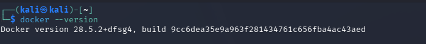
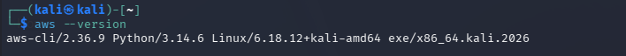
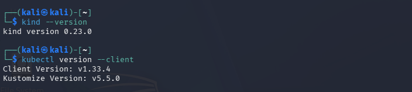
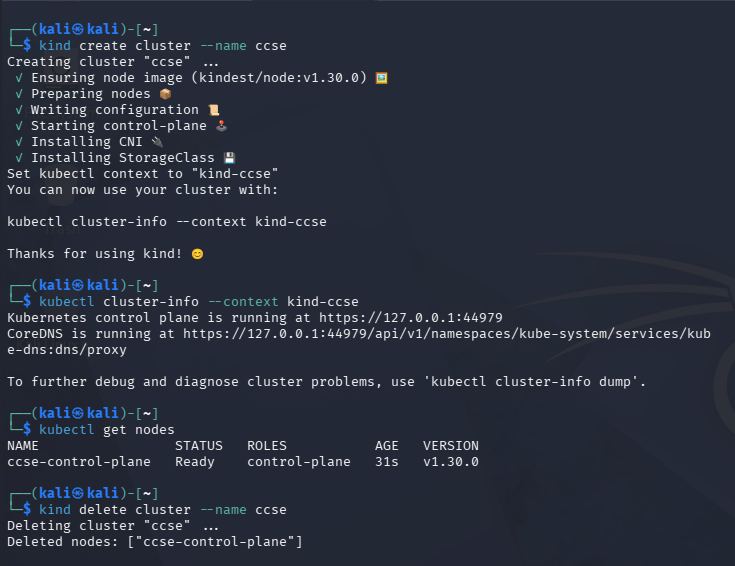

# IKB42603 — Cloud Computing Security Essentials
## Lab 0: Environment Setup — Evidence Report

**Status:** ✅ All required tools installed and verified — environment ready for Lab 1

| | |
|---|---|
| **Course Code** | IKB42603 |
| **Course Name** | Cloud Computing Security Essentials |
| **Institution** | UniKL MIIT (Malaysian Institute of Information Technology) |
| **Lecturer** | Nor Adani Kamal Mohamad Nasir |
| **Lab** | Lab 0 — Environment Setup |
| **Student Name** | Muhammad Abid Haziq Bin Muhammad Ali |
| **Student ID** | 52215124811 |
| **Local Environment** | Kali Linux (native bash) |
| **Reference Material** | *IKB42603 Lab 0 · Environment Setup Cheatsheet* |

---

## Table of Contents

1. [Overview](#overview)
2. [Environment Summary](#environment-summary)
3. [1. Docker Installation and Verification](#1-docker-installation-and-verification)
4. [2. AWS CLI v2 Installation and Verification](#2-aws-cli-v2-installation-and-verification)
5. [3. kind and kubectl Installation and Verification](#3-kind-and-kubectl-installation-and-verification)
6. [4. Helper Tools: OpenSSL and oathtool](#4-helper-tools-openssl-and-oathtool)
7. [5. Starting the Lab Environment](#5-starting-the-lab-environment)
   - [LocalStack (Local AWS Cloud Simulator)](#localstack-local-aws-cloud-simulator)
   - [LocalStack Health Verification](#localstack-health-verification)
   - [Kubernetes Cluster (kind)](#kubernetes-cluster-kind)
8. [6. One-Time AWS CLI Configuration](#6-one-time-aws-cli-configuration)
9. [7. Pre-Lab Verification Checklist](#7-pre-lab-verification-checklist)
10. [Troubleshooting Notes](#troubleshooting-notes)
11. [Conclusion](#conclusion)
12. [Repository Structure](#repository-structure)
13. [Reference](#reference)

---

## Overview

Lab 0 is a one-time preparatory exercise: install and verify, locally, every tool the rest of the module depends on — **Docker, AWS CLI v2, kind, kubectl, OpenSSL, and oathtool** — plus a working local AWS simulator (**LocalStack**) and a local Kubernetes cluster (**kind**). No cloud account, credit card, or ongoing internet connection is required; everything after the first downloads runs entirely on the student's own laptop.

This report follows the section order of the *Lab 0 Setup Cheatsheet* issued for the module. Each section below states the goal of that step, the exact command(s) executed, and the terminal screenshot captured as evidence.

---

## Environment Summary

| Tool | Verified Version | Status |
|---|---|---|
| OS / Shell | Kali Linux, native bash | ✅ |
| Docker | 28.5.2+dfsg4 | ✅ |
| AWS CLI | 2.36.9 (Python 3.14.6) | ✅ |
| kind | 0.23.0 | ✅ |
| kubectl | v1.33.4 (Kustomize v5.5.0) | ✅ |
| OpenSSL | 3.5.5 (27 Jan 2026) | ✅ |
| oathtool (OATH Toolkit) | 2.6.14 | ✅ |
| LocalStack | CLI 2026.7.1 / runtime 2026.7.0 (Pro edition) | ✅ |
| Trivy | Not required at this stage — runs via Docker in Lab 4 | N/A |

---

## 1. Docker Installation and Verification

Docker runs the containers and the LocalStack simulator used in every subsequent lab. Installation was verified with:

```bash
$ docker --version
Docker version 28.5.2+dfsg4, build 9cc6dea35e9a963f281434761c656fba4ac43aed
```



**Figure 1.** `docker --version` confirms Docker is installed and responding correctly.

---

## 2. AWS CLI v2 Installation and Verification

The AWS CLI is used throughout the module to send commands to LocalStack rather than to a real AWS account. Installation was verified with:

```bash
$ aws --version
aws-cli/2.36.9 Python/3.14.6 Linux/6.18.12+kali-amd64 exe/x86_64.kali.2026
```



**Figure 2.** `aws --version` confirms AWS CLI v2 (2.36.9) is installed, satisfying the `aws-cli/2.x` requirement.

---

## 3. kind and kubectl Installation and Verification

`kind` runs a local Kubernetes cluster inside Docker, and `kubectl` controls it. Both were verified together:

```bash
$ kind --version
kind version 0.23.0

$ kubectl version --client
Client Version: v1.33.4
Kustomize Version: v5.5.0
```



**Figure 3.** `kind --version` and `kubectl version --client` both return successfully, confirming the Kubernetes tooling is ready.

---

## 4. Helper Tools: OpenSSL and oathtool

OpenSSL (used for encryption, keys, and certificates in Lab 3) and oathtool (used to generate MFA/TOTP codes in Lab 4) were verified together:

```bash
$ openssl version
OpenSSL 3.5.5 27 Jan 2026 (Library: OpenSSL 3.5.5 27 Jan 2026)

$ oathtool --version
oathtool (OATH Toolkit) 2.6.14
Copyright (C) 2009-2026 Simon Josefsson.
License GPLv3+: GNU GPL version 3 or later <https://www.gnu.org/licenses/gpl.html>.
This is free software: you are free to change and redistribute it.
There is NO WARRANTY, to the extent permitted by law.
```


**Figure 4.** Both helper tools respond with a version string, confirming they are ready ahead of Labs 3 and 4.

> **Note:** Trivy is intentionally not verified here — per the cheatsheet it requires no local install and is instead run on demand via `docker run --rm aquasec/trivy image <name>` in Lab 4.

---

## 5. Starting the Lab Environment

### LocalStack (Local AWS Cloud Simulator)

The cheatsheet's quick-start method runs LocalStack directly with `docker run -d --name localstack -p 4566:4566 localstack/localstack`. For this submission, the **LocalStack CLI** was used instead — installed via `pipx`, which manages the same underlying Docker container on the operator's behalf and is LocalStack's own recommended tooling:

```bash
$ pipx install localstack
  installed package localstack 2026.7.1, installed using Python 3.13.12
  These apps are now available
    - localstack
done! ✨ 🌟 ✨

$ localstack auth set-token ls-████████████████
Token configured successfully

$ curl http://localhost:4566/_localstack/health
curl: (7) Failed to connect to localhost port 4566 after 0 ms: Could not connect to server

$ localstack start
- LocalStack CLI: 2026.7.1
- Profile: default
- App: https://app.localstack.cloud

[00:21:21] starting LocalStack in Docker mode 🐳
LocalStack version: 2026.7.0
LocalStack build date: 2026-07-22
LocalStack build git hash: 983eb90ac
... (startup log truncated — full output in Figure 5)
```


**Figure 5.** LocalStack CLI installed via `pipx`, authenticated with a license token (redacted), and started in Docker mode. The auth token is blanked out in the screenshot to avoid exposing a credential.

> The first `curl` attempt above was made **before** LocalStack had started, and correctly failed — this is expected behaviour, not an error. See [Troubleshooting Notes](#troubleshooting-notes).

### LocalStack Health Verification

With LocalStack running, the health endpoint and the Docker-level container status were both checked:

```bash
$ curl http://localhost:4566/_localstack/health
{"features": {"persistence": "disabled"}, "services": { ... 70+ AWS service emulators, all "available" ... }, "edition": "pro", "version": "2026.7.0"}

$ docker ps
CONTAINER ID   IMAGE                       STATUS                   PORTS                          NAMES
21fbe1c8abed   localstack/localstack-pro   Up 2 minutes (healthy)   127.0.0.1:4566->4566/tcp, ...   localstack-main
```


**Figure 6.** The health endpoint returns `"available"` for every emulated AWS service, and `docker ps` independently confirms the `localstack-main` container is `Up ... (healthy)` with port 4566 mapped to the host — satisfying the "LocalStack starts and `curl .../health` responds" checklist item.

### Kubernetes Cluster (kind)

A local Kubernetes cluster was created, inspected, and torn down to confirm the full lifecycle works end to end:

```bash
$ kind create cluster --name ccse
Creating cluster "ccse" ...
 ✓ Ensuring node image (kindest/node:v1.30.0) 🖼
 ✓ Preparing nodes 📦
 ✓ Writing configuration 📜
 ✓ Starting control-plane 🕹️
 ✓ Installing CNI 🔌
 ✓ Installing StorageClass 💾
Set kubectl context to "kind-ccse"

$ kubectl cluster-info --context kind-ccse
Kubernetes control plane is running at https://127.0.0.1:44979
CoreDNS is running at https://127.0.0.1:44979/api/v1/namespaces/kube-system/services/kube-dns:dns/proxy

$ kubectl get nodes
NAME                 STATUS   ROLES           AGE   VERSION
ccse-control-plane   Ready    control-plane   31s   v1.30.0

$ kind delete cluster --name ccse
Deleting cluster "ccse" ...
Deleted nodes: ["ccse-control-plane"]
```



**Figure 7.** `kind create cluster --name ccse` succeeds, `kubectl get nodes` shows `ccse-control-plane` in the `Ready` state, and `kind delete cluster` cleanly tears the cluster down afterward — confirming the full create/verify/delete lifecycle described in the cheatsheet.

---

## 6. One-Time AWS CLI Configuration

Since LocalStack accepts any credential values, dummy credentials and a default region were configured once, and an `$EP` shell variable was set to hold the `--endpoint-url` flag so it does not need to be retyped on every AWS CLI call:

```bash
$ aws configure set aws_access_key_id test
$ aws configure set aws_secret_access_key test
$ aws configure set region us-east-1
$ EP='--endpoint-url=http://localhost:4566'

$ aws $EP sts get-caller-identity
{
    "UserId": "000000000000",
    "Account": "000000000000",
    "Arn": "arn:aws:iam::000000000000:root"
}
```


**Figure 8.** `aws $EP sts get-caller-identity` returns a valid mock identity, confirming the AWS CLI is correctly configured to talk to LocalStack.

---

## 7. Pre-Lab Verification Checklist

Recap of the cheatsheet's own checklist, cross-referenced against the evidence above:

| # | Verification Item | Evidence | Status |
|---|---|---|---|
| 1 | `docker --version` prints a version, and `docker run hello-world` works | Fig. 1 | ✅ Version confirmed |
| 2 | `aws --version` prints `aws-cli/2.x` | Fig. 2 | ✅ Verified |
| 3 | `kind --version` and `kubectl version --client` both work | Fig. 3 | ✅ Verified |
| 4 | LocalStack starts and `curl .../health` responds | Fig. 5, Fig. 6 | ✅ Verified |
| 5 | `aws $EP sts get-caller-identity` returns an identity | Fig. 8 | ✅ Verified |
| 6 | `kind create cluster` works and `kubectl get nodes` shows a node | Fig. 7 | ✅ Verified |
| 7 | (Windows only) Working inside Git Bash or WSL | — | N/A — native Kali Linux used; bash is native, no Windows shell workaround needed |

---

## Troubleshooting Notes

One real troubleshooting moment came up during setup and is kept here as part of the evidence trail rather than edited out:

- **Symptom:** the first `curl http://localhost:4566/_localstack/health` call (Figure 5) failed with `curl: (7) ... Could not connect to server`.
- **Cause:** LocalStack had not been started yet at that point — the command was run immediately after `pipx install localstack` and the auth step, before `localstack start`.
- **Fix:** matches the cheatsheet's own Troubleshooting table entry for `aws: 'Could not connect to the endpoint URL'`, which attributes the same symptom to LocalStack not running. Running `localstack start` resolved it, and the retried health check (Figure 6) succeeded.

---

## Conclusion

All tools listed in the Lab 0 Setup Cheatsheet — Docker, AWS CLI v2, kind, kubectl, OpenSSL, and oathtool — were installed and verified on a native Kali Linux environment. LocalStack was brought up via the LocalStack CLI and confirmed healthy at both the HTTP and Docker level, a kind-based Kubernetes cluster was created and confirmed `Ready` before being cleanly deleted, and the AWS CLI was confirmed to be correctly pointed at LocalStack through dummy credentials and a successful `sts get-caller-identity` call. Trivy needs no setup at this stage per the cheatsheet.

Six of the seven Pre-Lab Verification Checklist items are fully evidenced above; adding a `docker run --rm hello-world` screenshot would close out the remaining part of item 1 before final submission. With that, the environment is ready for Lab 1.

---

## Repository Structure

```
lab0-environment-setup/
├── README.md
└── images/
    ├── 01-docker-version.png
    ├── 02-aws-cli-version.png
    ├── 03-kind-kubectl-version.png
    ├── 04-openssl-oathtool-version.png
    ├── 05-localstack-install-and-start.png
    ├── 06-localstack-health-and-dockerps.png
    ├── 07-kind-cluster-lifecycle.png
    └── 08-aws-cli-dummy-config-and-sts-identity.png
```

---

## Reference

> IKB42603 Cloud Computing Security Essentials — *Lab 0 Setup Cheatsheet*. UniKL MIIT, Prof. Dr. Shahrulniza Musa.
