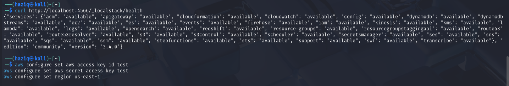
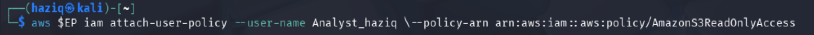
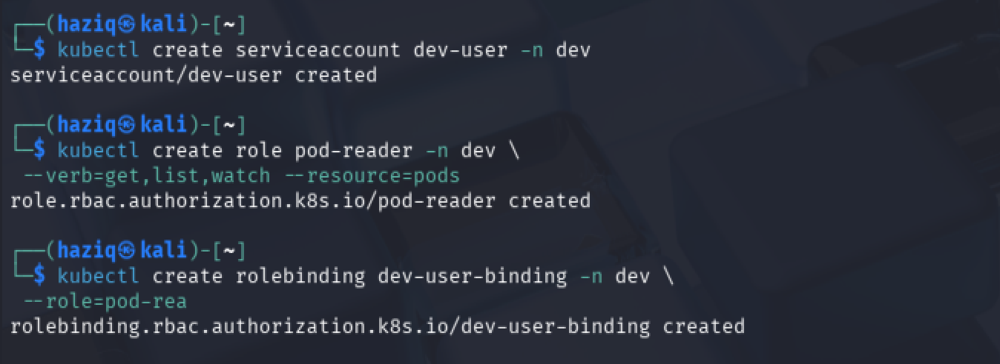
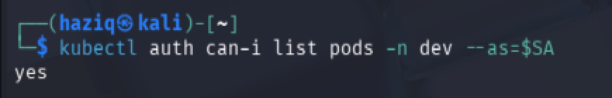

# IKB42603 Cloud Computing Security Essentials

## Lab 1 — Cloud Account Security, Identity & Access Management

> **Identity governance and least privilege using LocalStack IAM and Kubernetes RBAC**

---

## Student Information

| Item | Details |
|---|---|
| **Student Name** | Muhammad Abid Haziq Bin Muhammad Ali |
| **Student ID** | 52215124811 |
| **Module Code** | IKB42603 |
| **Module Name** | Cloud Computing Security Essentials |
| **Lab** | Lab 1 — Cloud Account Security, Identity & Access Management |
| **Institution** | Universiti Kuala Lumpur Malaysian Institute of Information Technology (UniKL MIIT) |
| **Lecturer** | Nor Adani Kamal Mohamad Nasir |

---

## Table of Contents

- [1. Introduction](#1-introduction)
- [2. Lab Learning Outcomes](#2-lab-learning-outcomes)
- [3. Lab Environment](#3-lab-environment)
- [4. Session A — Cloud Identity with LocalStack](#4-session-a--cloud-identity-with-localstack)
  - [4.1 Environment Setup](#41-environment-setup)
  - [4.2 Task 1 — Map the Cloud Identity Landscape](#42-task-1--map-the-cloud-identity-landscape)
  - [4.3 Task 2 — Create a Least-Privilege Admin](#43-task-2--create-a-least-privilege-admin)
  - [4.4 Task 3 — Enforce Least Privilege with a Scoped Policy](#44-task-3--enforce-least-privilege-with-a-scoped-policy)
  - [4.5 Task 4 — Credential Hygiene and Access Keys](#45-task-4--credential-hygiene-and-access-keys)
- [5. Session B — Enforced Access Control with Kubernetes RBAC](#5-session-b--enforced-access-control-with-kubernetes-rbac)
  - [5.1 Kubernetes Cluster Setup](#51-kubernetes-cluster-setup)
  - [5.2 Task 5 — Separate Environments with Namespaces](#52-task-5--separate-environments-with-namespaces)
  - [5.3 Task 6 — Define a Role and Bind It](#53-task-6--define-a-role-and-bind-it)
  - [5.4 Task 7 — Test That Access Control Works](#54-task-7--test-that-access-control-works)
- [6. Short-Answer Questions](#6-short-answer-questions)
- [7. Verification Command](#7-verification-command)
- [8. Security Best-Practices Checklist](#8-security-best-practices-checklist)
- [9. Discussion and Key Security Findings](#9-discussion-and-key-security-findings)
- [10. Cleanup and Teardown](#10-cleanup-and-teardown)
- [11. Conclusion](#11-conclusion)
- [12. References](#12-references)

---

# 1. Introduction

This report documents the completion of **Lab 1: Cloud Account Security, Identity & Access Management** for the IKB42603 Cloud Computing Security Essentials module. The lab focuses on identity governance, least privilege, credential hygiene, and access-control enforcement using two local technologies: **LocalStack IAM** and **Kubernetes RBAC**.

Session A uses LocalStack to simulate AWS Identity and Access Management (IAM) locally. This makes it possible to practise creating users, groups, policies, and access keys without connecting to a real AWS account. Session B uses a local Kubernetes cluster created with `kind` to demonstrate how Role-Based Access Control (RBAC) can actively allow or deny actions based on an identity's assigned permissions.

The main security idea throughout the lab is the **principle of least privilege**. An identity should receive only the permissions required for its job and nothing more. The lab also shows how this reduces the possible **blast radius** when an account or credential is compromised.

---

# 2. Lab Learning Outcomes

By completing this lab, the following outcomes were addressed:

1. Set up a local cloud lab using Docker and LocalStack.
2. Replace routine root usage with scoped IAM users, groups, and policies.
3. Create and verify fine-grained permissions by distinguishing allowed and denied operations.
4. Configure and test Kubernetes RBAC as an enforcement mechanism.
5. Review access-key usage and credential hygiene.

The lab supports secure cloud operations by showing how identity and authorization controls can be configured to protect cloud resources and reduce unnecessary privilege.

---

# 3. Lab Environment

The lab was completed using the following tools and technologies:

| Component | Purpose |
|---|---|
| **Kali Linux** | Terminal environment used to run the lab commands |
| **Docker** | Runs LocalStack and supports the local Kubernetes environment |
| **LocalStack** | Local AWS-compatible cloud simulator used for IAM exercises |
| **AWS CLI** | Used to manage IAM users, groups, policies, and access keys |
| **kind** | Creates a Kubernetes cluster inside Docker |
| **kubectl** | Used to manage the Kubernetes cluster and test RBAC |

> **Security Note:** The LocalStack environment used in this lab is local. The IAM commands shown in this report were directed to `http://localhost:4566`, not to a real AWS account.

---

# 4. Session A — Cloud Identity with LocalStack

## 4.1 Environment Setup

The LocalStack service was first checked to confirm that the local AWS-compatible environment was running. The AWS CLI was then configured using the dummy credentials accepted by LocalStack.

Commands used:

```bash
# Confirm Docker is installed and running
docker --version

# Start LocalStack
docker run -d --name localstack -p 4566:4566 localstack/localstack

# Confirm LocalStack health
curl http://localhost:4566/_localstack/health

# Configure dummy AWS CLI credentials for LocalStack
aws configure set aws_access_key_id test
aws configure set aws_secret_access_key test
aws configure set region us-east-1
```



*Figure 1: LocalStack health output showing the local services as available, followed by configuration of the AWS CLI dummy access key, secret key, and `us-east-1` region.*

The health output confirms that the LocalStack services were available and that the AWS CLI configuration was prepared for the lab.

### Verify the Operating Identity

The identity currently being used was checked with:

```bash
aws --endpoint-url=http://localhost:4566 sts get-caller-identity
```


*Figure 2: Output of `sts get-caller-identity`, showing the simulated LocalStack root identity before a dedicated administrator account was created.*

The screenshot shows the following important information:

```text
Account: 000000000000
Arn: arn:aws:iam::000000000000:root
```

This demonstrates why the lab later creates a separate administrative identity instead of continuing to depend on the root identity for routine administration.

---

## 4.2 Task 1 — Map the Cloud Identity Landscape

The main cloud identity concepts used in the lab are summarized below.

| Concept | AWS Term | Purpose |
|---|---|---|
| All-powerful owner | **Root User** | The highest-privileged account identity. It has full control and should be protected carefully and avoided for normal day-to-day administration. |
| Human/app identity | **IAM User** | A persistent identity for a person or application that can be assigned credentials and permissions. |
| Permission bundle | **IAM Policy** | A collection of rules that defines which actions are allowed or denied on particular resources. |
| Collection of users | **IAM Group** | A way to manage permissions for multiple IAM users together by attaching policies to the group. |
| Temporary identity | **IAM Role** | An assumable identity that provides permissions through temporary credentials instead of relying on permanent user credentials. |

These components separate identity management from permission management. This makes cloud access easier to control, review, and audit.

---

## 4.3 Task 2 — Create a Least-Privilege Admin

The lab requires routine root usage to be replaced by a dedicated administrator identity. Permissions are assigned through an IAM group rather than directly to the user.

### 4.3.1 Create the LocalStack Endpoint Variable

To make the commands shorter, the LocalStack endpoint was stored in the `$EP` shell variable:

```bash
EP='--endpoint-url=http://localhost:4566'
```


*Figure 3: The LocalStack endpoint stored in the `$EP` shell variable for reuse in later AWS CLI commands.*

### 4.3.2 Create the `Admins` Group and Attach the Admin Policy

The administrator group was created and the AWS managed `AdministratorAccess` policy was attached to the **group**:

```bash
aws $EP iam create-group --group-name Admins

aws $EP iam attach-group-policy \
  --group-name Admins \
  --policy-arn arn:aws:iam::aws:policy/AdministratorAccess
```


*Figure 4: Creation of the `Admins` IAM group and attachment of the `AdministratorAccess` managed policy to the group.*

This is better than attaching the administrator policy separately to every user because the group becomes the central point for permission management.

### 4.3.3 Create the Personal Cloud Administrator

The personal administrator account was created as `CloudAdmin_haziq`:

```bash
aws $EP iam create-user --user-name CloudAdmin_haziq
```


*Figure 5: Successful creation of the `CloudAdmin_haziq` IAM user.*

### 4.3.4 Add the Administrator to the Group

The new user was added to the `Admins` group:

```bash
aws $EP iam add-user-to-group \
  --group-name Admins \
  --user-name CloudAdmin_haziq
```


*Figure 6: `CloudAdmin_haziq` added to the `Admins` group so that administrative permission is inherited through group membership.*

The permission relationship is therefore:

```text
AdministratorAccess policy
          ↓
      Admins group
          ↓
   CloudAdmin_haziq
```

### 4.3.5 Verify Group Membership

The group membership was verified using:

```bash
aws $EP iam get-group --group-name Admins
```


*Figure 7: `get-group` output confirming that `CloudAdmin_haziq` is a member of the `Admins` IAM group.*

This screenshot is one of the required lab deliverables because it proves that the administrator user receives its permissions through the group.

---

## 4.4 Task 3 — Enforce Least Privilege with a Scoped Policy

Task 3 creates a second identity for an Analyst who should be able to read S3 data but should not receive general administrative access.

### 4.4.1 Create the Analyst User

```bash
aws $EP iam create-user --user-name Analyst_haziq
```


*Figure 8: Successful creation of the `Analyst_haziq` IAM user.*

### 4.4.2 Attach the S3 Read-Only Policy

The AWS managed `AmazonS3ReadOnlyAccess` policy was attached to the Analyst account:

```bash
aws $EP iam attach-user-policy \
  --user-name Analyst_haziq \
  --policy-arn arn:aws:iam::aws:policy/AmazonS3ReadOnlyAccess
```



*Figure 9: The `AmazonS3ReadOnlyAccess` managed policy attached to `Analyst_haziq`.*

This gives the Analyst a much smaller permission scope than the administrator account.

### 4.4.3 Verify the Analyst Policy

The policy assigned to the Analyst account was checked with:

```bash
aws $EP iam list-attached-user-policies --user-name Analyst_haziq
```


*Figure 10: `list-attached-user-policies` output showing that `Analyst_haziq` has the `AmazonS3ReadOnlyAccess` policy.*

The result shows only the intended read-only policy, which demonstrates the least-privilege approach required by the lab.

### Least Privilege and Blast Radius

If the Analyst account were stolen, the attacker would gain the permissions assigned to that account, but would not automatically gain the broad administrator capabilities assigned to `CloudAdmin_haziq`.

Because `Analyst_haziq` has only S3 read-only access, the possible damage is more limited. This reduces the **blast radius**, meaning that a single compromised account exposes a smaller part of the environment.

In simple terms:

```text
Broad permissions  → larger possible blast radius
Scoped permissions → smaller possible blast radius
```

Least privilege does not guarantee that an account can never be compromised, but it reduces what an attacker can do after a compromise occurs.

---

## 4.5 Task 4 — Credential Hygiene and Access Keys

Programmatic access commonly uses access keys. Task 4 demonstrates creating an access key, checking its status, and deactivating it as part of credential rotation.

### 4.5.1 Create an Access Key

```bash
aws $EP iam create-access-key --user-name Analyst_haziq
```


*Figure 11: A LocalStack access key created for `Analyst_haziq`. The screenshot contains a LocalStack-generated lab credential and is included only as assignment evidence.*

> **Credential Hygiene Note:** In a real AWS environment, a `SecretAccessKey` should never be committed to GitHub or included in a public report. This lab uses LocalStack rather than a real AWS account, but the same secure handling principle still applies.

### 4.5.2 List the Access Keys

The key metadata was checked with:

```bash
aws $EP iam list-access-keys --user-name Analyst_haziq
```


*Figure 12: Access-key metadata for `Analyst_haziq`, showing the AccessKeyId and its initial `Active` status.*

The listing confirms that the new access key was active before the rotation/deactivation step.

### 4.5.3 Deactivate the Existing Key

The key was then deactivated:

```bash
aws $EP iam update-access-key \
  --user-name Analyst_haziq \
  --access-key-id <ACCESS_KEY_ID> \
  --status Inactive
```


*Figure 13: The Analyst access key being changed to `Inactive`, demonstrating the deactivation stage of key rotation.*

Long-lived keys are risky because a leaked credential can remain usable until it is manually deactivated or deleted. Possible exposure locations include source code, Git repositories, configuration files, logs, shell history, and compromised workstations.

Where possible, temporary credentials and roles are safer because they reduce reliance on permanent credentials.

---

# 5. Session B — Enforced Access Control with Kubernetes RBAC

LocalStack is used in Session A to practise IAM concepts. In Session B, Kubernetes RBAC is used to demonstrate real authorization enforcement, where unauthorized actions are actively blocked.

## 5.1 Kubernetes Cluster Setup

A local Kubernetes cluster named `ccse-lab1` was created using `kind`:

```bash
kind create cluster --name ccse-lab1
```

The cluster was checked using:

```bash
kubectl cluster-info --context kind-ccse-lab1
kubectl get nodes
```


*Figure 14: Creation of the `ccse-lab1` kind cluster, followed by cluster information and node status showing the control-plane node in the `Ready` state.*

The result confirms that the local Kubernetes cluster was running correctly before RBAC configuration began.

---

## 5.2 Task 5 — Separate Environments with Namespaces

Two namespaces were created to represent development and production environments:

```bash
kubectl create namespace dev
kubectl create namespace prod
kubectl get namespaces
```


*Figure 15: Creation of the `dev` and `prod` namespaces. The namespace listing confirms that both environments are active.*

Namespaces provide logical separation inside the same Kubernetes cluster. This becomes important because the developer's RBAC permission is intentionally scoped to `dev` and should not automatically extend into `prod`.

---

## 5.3 Task 6 — Define a Role and Bind It

Task 6 creates a developer service account, a read-only pod Role in the `dev` namespace, and a RoleBinding that assigns that Role to the service account.

### 5.3.1 Create the Developer Service Account

```bash
kubectl create serviceaccount dev-user -n dev
```

### 5.3.2 Create the `pod-reader` Role

```bash
kubectl create role pod-reader -n dev \
  --verb=get,list,watch \
  --resource=pods
```

The Role allows only the following pod operations:

```text
get
list
watch
```

It does not grant modification actions such as `create`, `update`, or `delete`.

### 5.3.3 Create the RoleBinding

```bash
kubectl create rolebinding dev-user-binding -n dev \
  --role=pod-reader \
  --serviceaccount=dev:dev-user
```



*Figure 16: Successful creation of the `dev-user` ServiceAccount, the `pod-reader` Role, and the `dev-user-binding` RoleBinding in the `dev` namespace.*

The RBAC relationship is:

```text
dev-user ServiceAccount
          ↓
dev-user-binding RoleBinding
          ↓
pod-reader Role
          ↓
get / list / watch pods
          ↓
dev namespace only
```

This configuration follows least privilege because the developer identity receives only the pod-reading permissions required in the development namespace.

---

## 5.4 Task 7 — Test That Access Control Works

The service-account identity was represented as:

```bash
SA=system:serviceaccount:dev:dev-user
```

The `kubectl auth can-i` command was then used to test the RBAC boundary.

### Test 1 — List Pods in `dev`

```bash
kubectl auth can-i list pods -n dev --as=$SA
```

Result:

```text
yes
```



*Figure 17: Kubernetes returns `yes` when `dev-user` attempts to list pods in the `dev` namespace.*

This request succeeds because `list` is one of the verbs granted by the `pod-reader` Role and the request is being made inside the `dev` namespace.

### Test 2 — Delete Pods in `dev`

```bash
kubectl auth can-i delete pods -n dev --as=$SA
```

Result:

```text
no
```

The request is denied because `delete` was never granted by the `pod-reader` Role.

### Test 3 — List Pods in `prod`

```bash
kubectl auth can-i list pods -n prod --as=$SA
```

Result:

```text
no
```


*Figure 18: Kubernetes denies both pod deletion in `dev` and pod listing in `prod`, producing the required `NO / NO` authorization results.*

The second denial happens because the Role and RoleBinding are namespaced to `dev`; those permissions do not automatically apply to `prod`.

### Summary of the Three Authorization Tests

| Test | Requested Action | Namespace | Result | Reason |
|---|---|---|---|---|
| 1 | List pods | `dev` | **YES** | `list` is permitted by `pod-reader` in `dev` |
| 2 | Delete pods | `dev` | **NO** | `delete` is not included in the Role |
| 3 | List pods | `prod` | **NO** | The RoleBinding does not extend into `prod` |

### Authentication vs Authorization

The service account represents the identity making the request:

```text
system:serviceaccount:dev:dev-user
```

The identity exists and is recognized by Kubernetes. RBAC then performs the **authorization** decision by checking whether that identity has permission to use the requested verb on the requested resource in the requested namespace.

Therefore:

```text
list pods in dev    → authorized → YES
delete pods in dev  → not authorized → NO
list pods in prod   → not authorized → NO
```

The failed delete and cross-namespace requests are blocked by authorization rules, not because the `dev-user` identity does not exist.

---

# 6. Short-Answer Questions

## Q1. Why is attaching policies to groups better than attaching them directly to users?

Attaching policies to groups is better because it centralizes permission management. If several users perform the same job, they can all be added to one group and inherit the same policy. This avoids repeatedly attaching and maintaining identical policies on individual accounts.

For example, in this lab `CloudAdmin_haziq` was added to the `Admins` group, while the `AdministratorAccess` policy was attached to the group. If another administrator were created later, that person could simply be added to the same group.

This makes permissions more consistent, easier to audit, and easier to update. A change can be made at the group level instead of changing each account separately.

---

## Q2. What is the difference between an IAM User and an IAM Role?

An **IAM User** is a persistent identity that normally represents a person or application. It may have long-term credentials such as access keys and can receive permissions through policies or group membership.

An **IAM Role** is an assumable identity. Rather than being treated like a permanent user account, a role is assumed when needed and normally provides temporary credentials for the duration of the session.

In short:

| IAM User | IAM Role |
|---|---|
| Persistent identity | Assumable/temporary identity |
| Can use long-lived credentials | Commonly uses temporary credentials |
| Usually represents a specific person or application | Can be assumed by permitted users, services, or workloads |

Roles are especially useful when temporary access is safer than distributing permanent credentials.

---

## Q3. Explain least privilege using the Analyst account, and how it reduces blast radius if compromised.

`Analyst_haziq` demonstrates least privilege because the account was given only `AmazonS3ReadOnlyAccess` rather than full administrator access. The Analyst therefore receives only the permission required for the intended task.

If this account is compromised, the attacker is limited to the capabilities assigned to the Analyst account instead of automatically receiving the much broader permissions of the administrator. This reduces the **blast radius**, which is the amount of the environment that can be affected by one compromised identity.

The principle can be summarized as giving an account **only what it needs, for only the scope it needs**.

---

## Q4. In Kubernetes, what is the difference between a Role and a RoleBinding?

A Kubernetes **Role** defines the permissions themselves — in other words, **what actions can be performed** on which resources inside a namespace.

In this lab, the `pod-reader` Role allows `get`, `list`, and `watch` on pods in `dev`.

A **RoleBinding** assigns that Role to an identity — in other words, **who receives the permissions**.

Here, `dev-user-binding` connects the `pod-reader` Role to the `dev-user` ServiceAccount.

```text
Role        = what actions are allowed
RoleBinding = who receives those allowed actions
```

---

## Q5. Why did the developer service account fail to access `prod`, and which security principle does that demonstrate?

The `dev-user` ServiceAccount failed to list pods in `prod` because its `pod-reader` Role and `dev-user-binding` RoleBinding were created specifically in the `dev` namespace. A namespaced Role does not automatically provide the same permission in another namespace.

This demonstrates the **principle of least privilege** because the developer receives access only to the intended development scope, while the production environment remains outside its authorization boundary.

It also demonstrates **environment separation**, because permission in `dev` does not automatically mean permission in `prod`.

---

# 7. Verification Command

The assignment brief requires the following command to prove that the Kubernetes RoleBinding is in place:

```bash
kubectl get rolebinding dev-user-binding -n dev -o yaml
```

This command should show that:

- the RoleBinding is named `dev-user-binding`;
- it is located in the `dev` namespace;
- it references the `pod-reader` Role; and
- its subject is the `dev-user` ServiceAccount in the `dev` namespace.

> **Evidence Status:** The image file named `18_kubernetes_rbac_denied_tests.png` in the supplied evidence does **not** contain the YAML output of the verification command. It contains the two denied `kubectl auth can-i` tests instead. Because the actual YAML output was not included in the provided evidence, it is not fabricated in this report.

The required command should be run and its real output added before final lecturer submission if the lecturer expects the exact YAML output as a separate deliverable.

---

# 8. Security Best-Practices Checklist

| Security Best Practice | Status | Evidence / Explanation |
|---|:---:|---|
| Root user is not used for routine daily tasks | ✅ | Dedicated `CloudAdmin_haziq` identity created |
| Administrative permissions are managed through a group | ✅ | `Admins` group and `CloudAdmin_haziq` membership verified |
| A least-privilege identity was created | ✅ | `Analyst_haziq` with `AmazonS3ReadOnlyAccess` |
| Access key creation was demonstrated | ✅ | Task 4.1 evidence |
| Access keys were listed | ✅ | Task 4.2 evidence |
| Key deactivation/rotation was demonstrated | ✅ | Task 4.3 evidence |
| Separate `dev` and `prod` namespaces were created | ✅ | Task 5 evidence |
| A Kubernetes Role was created | ✅ | `pod-reader` in `dev` |
| A Kubernetes RoleBinding was created | ✅ | `dev-user-binding` |
| Allowed operation was tested | ✅ | `list pods` in `dev` returned `yes` |
| Unauthorized delete was blocked | ✅ | `delete pods` in `dev` returned `no` |
| Cross-namespace access was blocked | ✅ | `list pods` in `prod` returned `no` |

---

# 9. Discussion and Key Security Findings

## 9.1 Dedicated Administrative Identity

The first identity check showed the LocalStack root identity. The lab then moved administrative access to `CloudAdmin_haziq`, with its permission inherited from the `Admins` group. This reflects the good practice of reserving the root identity for exceptional account-level tasks instead of normal administration.

## 9.2 Group-Based Permission Management

Attaching `AdministratorAccess` to the `Admins` group rather than directly to the user makes access easier to manage as the number of administrators grows. The group becomes the common source of authorization for users performing the same role.

## 9.3 Least Privilege and Blast-Radius Reduction

The Analyst account received a much narrower permission scope than the administrator. This limits what an attacker could do if that account were compromised. Least privilege therefore helps contain damage rather than giving every identity broad access by default.

## 9.4 Credential Hygiene

The access-key exercise showed that credentials have a lifecycle. They should be created only when needed, monitored, rotated, deactivated, and eventually deleted. Permanent credentials create more risk than short-lived credentials because a leaked key may remain usable for a longer period.

## 9.5 RBAC Enforcement

The most direct authorization evidence comes from the three Kubernetes tests:

```text
list pods in dev    → YES
delete pods in dev  → NO
list pods in prod   → NO
```

The results show that RBAC evaluates both the requested action and the requested namespace. The service account is allowed to perform exactly the operations specified by the Role and nothing more.

## 9.6 Separation Between Development and Production

The denial of access to `prod` demonstrates that permissions can be restricted to one logical environment even when both namespaces are in the same Kubernetes cluster. This is important because development identities should not automatically receive production access.

---

# 10. Cleanup and Teardown

After completing the lab, the local environments can be removed using the cleanup commands from the lab manual.

```bash
# Remove the Kubernetes cluster
kind delete cluster --name ccse-lab1

# Stop and remove LocalStack
docker stop localstack && docker rm localstack
```

This removes the temporary lab resources from the local machine.

---

# 11. Conclusion

Lab 1 successfully demonstrated the main concepts of **cloud account security, Identity and Access Management, least privilege, credential hygiene, and Kubernetes RBAC**.

In Session A, LocalStack was used to practise AWS-style IAM locally. The initial operating identity was confirmed, an `Admins` group was created, `CloudAdmin_haziq` was placed into that group, and the group membership was verified. A separate `Analyst_haziq` identity was then created with the more limited `AmazonS3ReadOnlyAccess` policy, demonstrating how least privilege reduces the blast radius of a compromised account. Access-key creation, listing, and deactivation also demonstrated the importance of credential lifecycle management.

In Session B, a local Kubernetes cluster was created using `kind`. Separate `dev` and `prod` namespaces were created, followed by a `dev-user` ServiceAccount, a `pod-reader` Role, and a `dev-user-binding` RoleBinding. The three authorization tests returned **YES / NO / NO**, proving that the developer could list pods in `dev`, could not delete pods in `dev`, and could not carry the same permission into `prod`.

Overall, the lab shows that cloud security requires more than simply knowing who a user is. A secure environment must also control **what that identity is allowed to do, where it is allowed to do it, and how credentials are managed over time**.

---

# 12. References

1. UniKL MIIT. **IKB42603 Cloud Computing Security Essentials — Lab 1: Cloud Account Security, Identity & Access Management.**
2. LocalStack Documentation. <https://docs.localstack.cloud/>
3. Kubernetes Documentation. **Using RBAC Authorization.** <https://kubernetes.io/docs/reference/access-authn-authz/rbac/>
4. Cloud Security Alliance. **Security Guidance v5 — Identity & Access Management.**
5. IKB42603 Course Lectures — Week 1 (Fundamentals), Week 2 (Security Architecture), Week 5 (Access Control), and Week 7 (Identity Management).

---

## Repository Structure

The repository is arranged as follows:

```text
IKB42603-Lab1/
├── README.md
└── images/
    ├── 01_localstack_environment_setup.png
    ├── 14_kubernetes_cluster_setup.png
    ├── 02_localstack_sts_identity.png
    ├── 03_localstack_endpoint_variable.png
    ├── 04_iam_admins_group_policy.png
    ├── 05_iam_cloudadmin_user_created.png
    ├── 06_iam_cloudadmin_added_to_group.png
    ├── 07_iam_admins_group_membership.png
    ├── 08_iam_analyst_user_created.png
    ├── 09_iam_analyst_readonly_policy_attached.png
    ├── 10_iam_analyst_policy_verification.png
    ├── 11_iam_analyst_access_key_created.png
    ├── 12_iam_analyst_access_key_listed.png
    ├── 13_iam_analyst_access_key_deactivated.png
    ├── 15_kubernetes_namespaces_created.png
    ├── 16_kubernetes_rbac_rolebinding_created.png
    ├── 17_kubernetes_rbac_allowed_test.png
    └── 18_kubernetes_rbac_denied_tests.png
```
