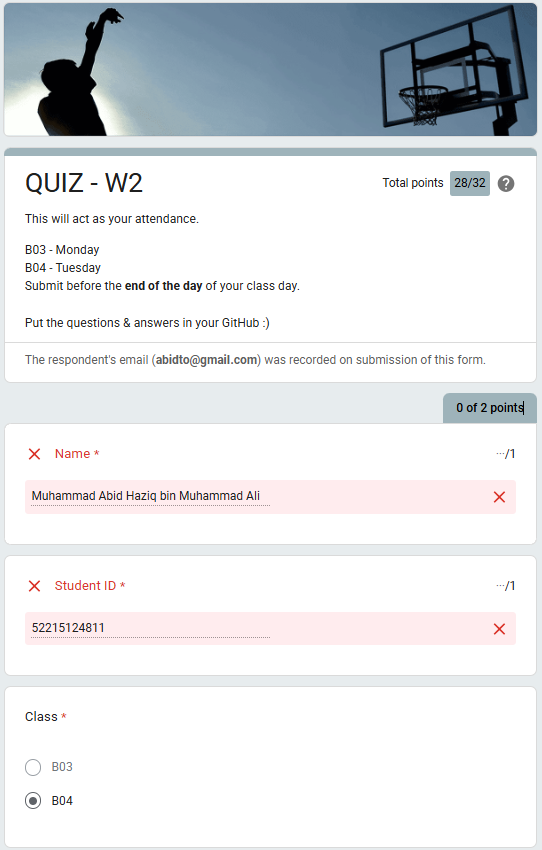
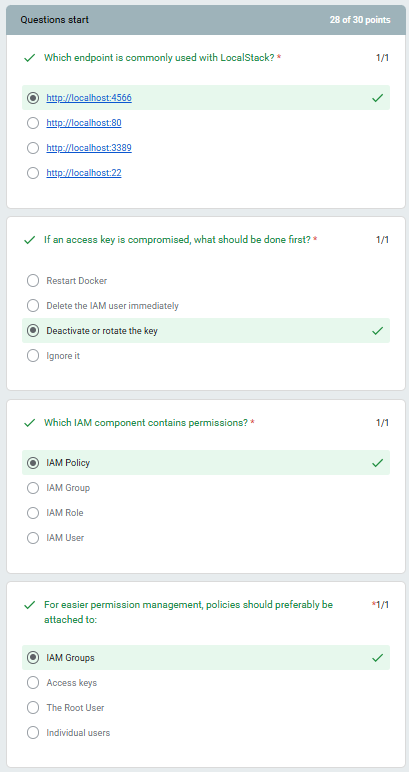
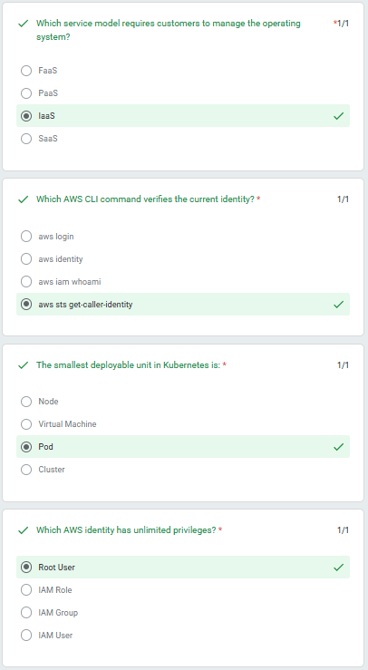
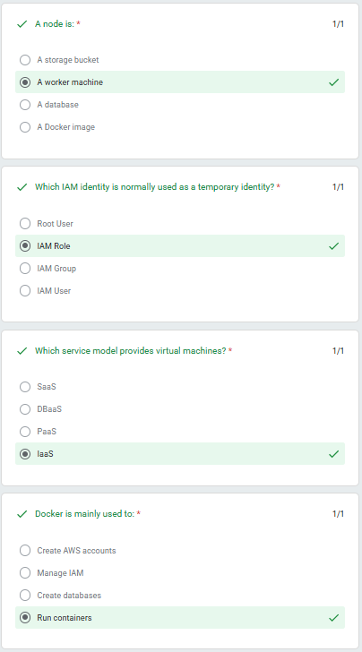
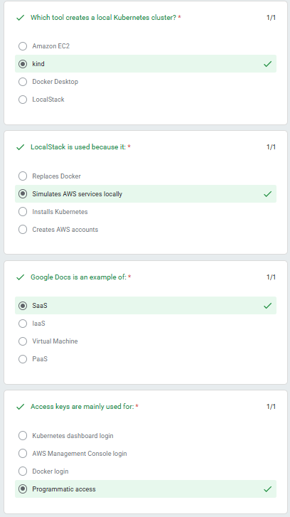
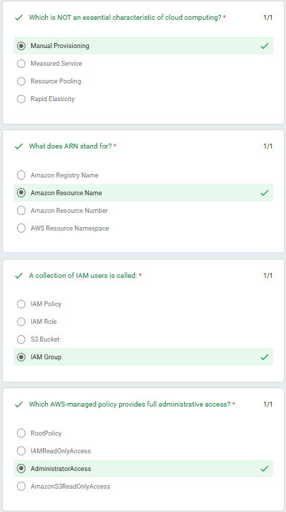
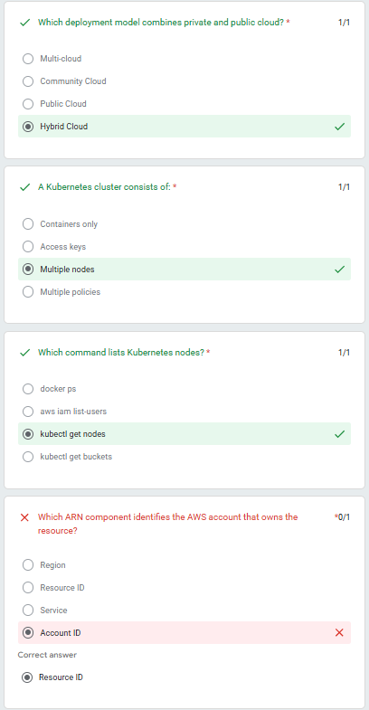
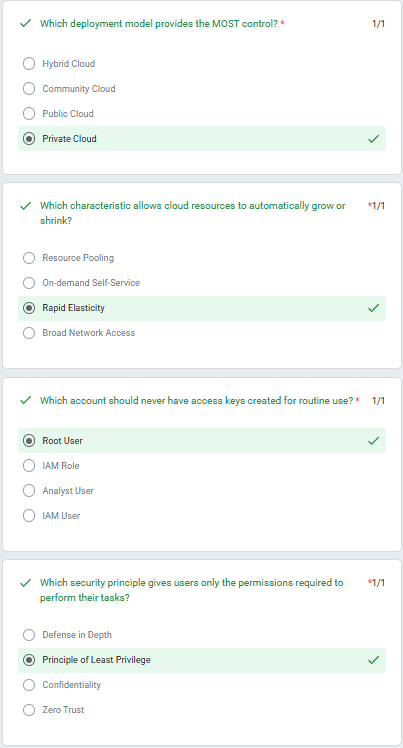

# QUIZ - W2

**Total points:** 28/32

This will act as your attendance.

- **B03** - Monday
- **B04** - Tuesday

Submit before the **end of the day** of your class day.

Put the questions & answers in your GitHub :)

*The respondent's email (`abidto@gmail.com`) was recorded on submission of this form.*

---

## Student Details

- **Name:** Muhammad Abid Haziq bin Muhammad Ali *(0/1 point)*
- **Student ID:** 52215124811 *(0/1 point)*
- **Class:** B04

---

## Questions & Answers

### 1. Which endpoint is commonly used with LocalStack?
- [x] `http://localhost:4566`
- [ ] `http://localhost:80`
- [ ] `http://localhost:3389`
- [ ] `http://localhost:22`

### 2. If an access key is compromised, what should be done first?
- [ ] Restart Docker
- [ ] Delete the IAM user immediately
- [x] Deactivate or rotate the key
- [ ] Ignore it

### 3. Which IAM component contains permissions?
- [x] IAM Policy
- [ ] IAM Group
- [ ] IAM Role
- [ ] IAM User

### 4. For easier permission management, policies should preferably be attached to:
- [x] IAM Groups
- [ ] Access keys
- [ ] The Root User
- [ ] Individual users

---

### 5. Which service model requires customers to manage the operating system?
- [ ] FaaS
- [ ] PaaS
- [x] IaaS
- [ ] SaaS

### 6. Which AWS CLI command verifies the current identity?
- [ ] `aws login`
- [ ] `aws identity`
- [ ] `aws iam whoami`
- [x] `aws sts get-caller-identity`

### 7. The smallest deployable unit in Kubernetes is:
- [ ] Node
- [ ] Virtual Machine
- [x] Pod
- [ ] Cluster

### 8. Which AWS identity has unlimited privileges?
- [x] Root User
- [ ] IAM Role
- [ ] IAM Group
- [ ] IAM User

---

### 9. A node is:
- [ ] A storage bucket
- [x] A worker machine
- [ ] A database
- [ ] A Docker image

### 10. Which IAM identity is normally used as a temporary identity?
- [ ] Root User
- [x] IAM Role
- [ ] IAM Group
- [ ] IAM User

### 11. Which service model provides virtual machines?
- [ ] SaaS
- [ ] DBaaS
- [ ] PaaS
- [x] IaaS

### 12. Docker is mainly used to:
- [ ] Create AWS accounts
- [ ] Manage IAM
- [ ] Create databases
- [x] Run containers

---

### 13. Which tool creates a local Kubernetes cluster?
- [ ] Amazon EC2
- [x] kind
- [ ] Docker Desktop
- [ ] LocalStack

### 14. LocalStack is used because it:
- [ ] Replaces Docker
- [x] Simulates AWS services locally
- [ ] Installs Kubernetes
- [ ] Creates AWS accounts

### 15. Google Docs is an example of:
- [x] SaaS
- [ ] IaaS
- [ ] Virtual Machine
- [ ] PaaS

### 16. Access keys are mainly used for:
- [ ] Kubernetes dashboard login
- [ ] AWS Management Console login
- [ ] Docker login
- [x] Programmatic access

---

### 17. Which is NOT an essential characteristic of cloud computing?
- [x] Manual Provisioning
- [ ] Measured Service
- [ ] Resource Pooling
- [ ] Rapid Elasticity

### 18. What does ARN stand for?
- [ ] Amazon Registry Name
- [x] Amazon Resource Name
- [ ] Amazon Resource Number
- [ ] AWS Resource Namespace

### 19. A collection of IAM users is called:
- [ ] IAM Policy
- [ ] IAM Role
- [ ] S3 Bucket
- [x] IAM Group

### 20. Which AWS-managed policy provides full administrative access?
- [ ] RootPolicy
- [ ] IAMReadOnlyAccess
- [x] AdministratorAccess
- [ ] AmazonS3ReadOnlyAccess

---

### 21. Which deployment model combines private and public cloud?
- [ ] Multi-cloud
- [ ] Community Cloud
- [ ] Public Cloud
- [x] Hybrid Cloud

### 22. A Kubernetes cluster consists of:
- [ ] Containers only
- [ ] Access keys
- [x] Multiple nodes
- [ ] Multiple policies

### 23. Which command lists Kubernetes nodes?
- [ ] `docker ps`
- [ ] `aws iam list-users`
- [x] `kubectl get nodes`
- [ ] `kubectl get buckets`

### 24. Which ARN component identifies the AWS account that owns the resource?
- [ ] Region
- [ ] Resource ID
- [ ] Service
- [ ] Account ID *(Note: Marked incorrect in screenshot; correct answer indicated as Resource ID)*

---

### 25. Which deployment model provides the MOST control?
- [ ] Hybrid Cloud
- [ ] Community Cloud
- [ ] Public Cloud
- [x] Private Cloud

### 26. Which characteristic allows cloud resources to automatically grow or shrink?
- [ ] Resource Pooling
- [ ] On-demand Self-Service
- [x] Rapid Elasticity
- [ ] Broad Network Access

### 27. Which account should never have access keys created for routine use?
- [x] Root User
- [ ] IAM Role
- [ ] Analyst User
- [ ] IAM User

### 28. Which security principle gives users only the permissions required to perform their tasks?
- [ ] Defense in Depth
- [x] Principle of Least Privilege
- [ ] Confidentiality
- [ ] Zero Trust

---

### 29. In the ARN `arn:aws:s3:::my-bucket`, which component represents the AWS service?
- [x] `s3`
- [ ] `aws`
- [ ] `my-bucket`
- [ ] `arn`

### 30. Cloud computing refers to:
- [ ] Installing software locally
- [ ] Running applications only on Windows
- [ ] Buying more physical servers
- [x] Delivering computing resources over the Internet

---

## Submission Details

Don't forget to submit your GitHub Link :)

**Thank You :)**
